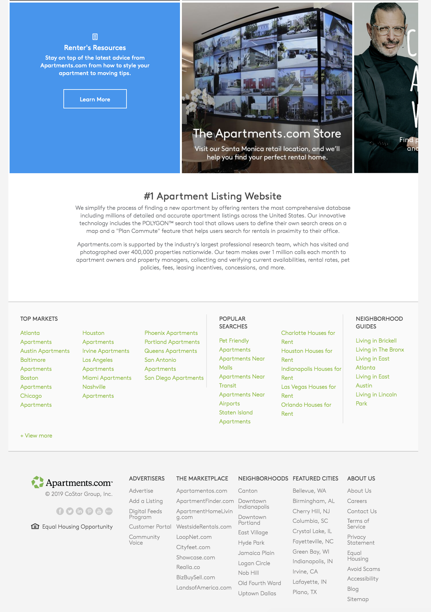
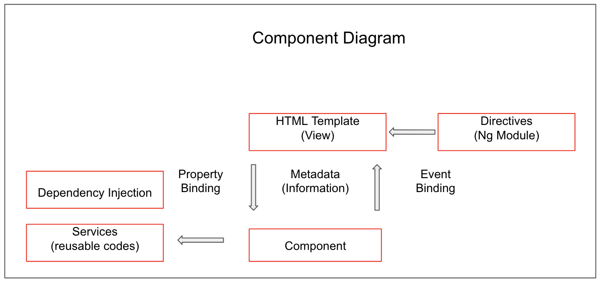
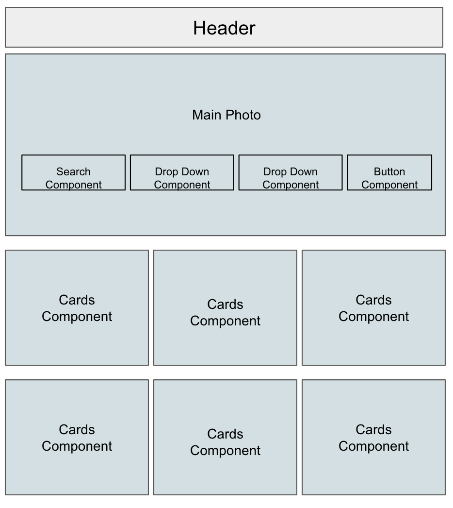
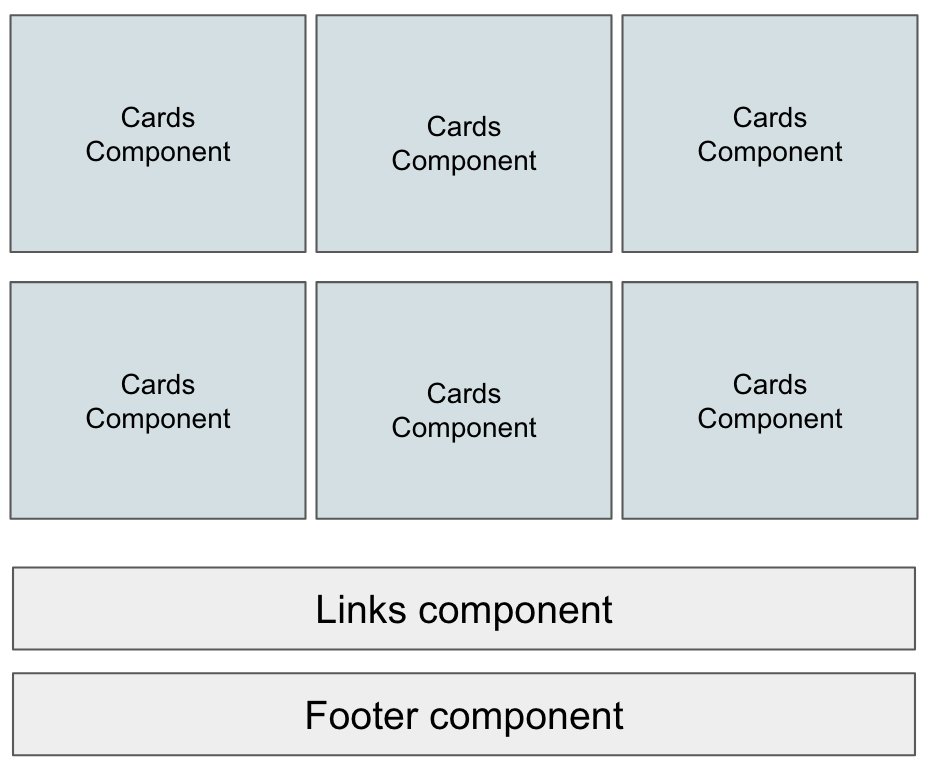

# CloneAngular

#### _Cloned website using Angular, March 29, 2019_

#### By _**Victoria Martinez**_

## Description

Rebuild an existing site using Angular with separated components, working database and live deployment.

## Objectives
* Choose a site that can be divided into multiple components.
* Project will need to have a working database.

## Original site


## Site Plan

_Planing on create site architecture_


_Components_
* Header component
* Main-Photo component
* Card component
* Index links component
* Footer component




_Models_
* Models

_Features_
* Drop-down header menu to link to different pages
* Click "English" and the site changes to Spanish Search Page
* Sign- up Authentication
* Click "Add to Listing" and page goes to a new page
* Hover over an image and image with zoom
* Drop-down price range
* Drop-down number of Beds and Baths
* Image Components to link to another page
* Click "Contact Button" to a pop-up form


## Development server

Run `ng serve` for a dev server. Navigate to `http://localhost:4200/`. The app will automatically reload if you change any of the source files.


## Build

Run `ng build` to build the project. The build artifacts will be stored in the `dist/` directory. Use the `-prod` flag for a production build.

## Firebase Credentials

* Before serving the project, go to https://firebase.google.com/.  Click on Get Started button.
* Create account if you don't already have one.
* Click to "Add project"
* Enter project name "clone-angular"
* Agree to controller-controller terms
* Click to create a project, once project is ready click continue
* You will enter a new page.  Click on </> symbol of the top portion of the main pages
* You will see a pop up page with your personal credentials.  
* Copy information, create api-keys.ts file int he src/app directory.

```bash
* export const masterFirebaseConfig = {
    apiKey: "xxxx",
    authDomain: "xxxx.firebaseapp.com",
    databaseURL: "https://xxxx.firebaseio.com",
    storageBucket: "xxxx.appspot.com",
    messagingSenderId: "xxxx"
  };
```
* enter following information and save

## Running unit tests

Run `ng test` to execute the unit tests via [Karma](https://karma-runner.github.io).

## Running end-to-end tests

Run `ng e2e` to execute the end-to-end tests via [Protractor](http://www.protractortest.org/).

## Further help and contact details

To get more help on the Angular CLI use `ng help` or go check out the [Angular CLI README](https://github.com/angular/angular-cli/blob/master/README.md).

For more question you may contact me at vmartinez72@liv.com

## Known bugs

There is no known Bugs

## Technologies used

* npm webpack
* Angular
* Bootstrap

### License
Copyright (c) 2019 **_Victoria Maartinez_**
