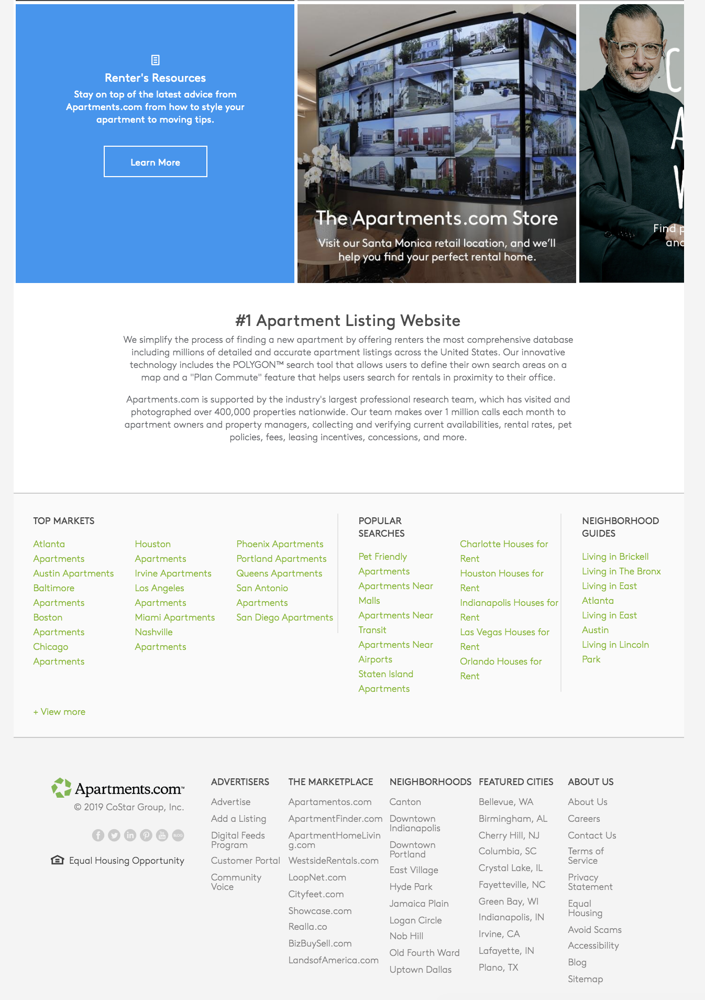

# CloneAngular

#### _Cloned website using Angular, March 29, 2019_

#### By _**Victoria Martinez**_

## Description

Rebuild an existing site using Angular with separated components, working database and live deployment.

## Objectives
* Choose a site that can be divided into multiple components.
* Project will need to have a working database.

## Original site

## Site Plan
_Components_
* Header component
* Main-Photo component
* Body component
* Index components
* Footer component

_Models_
* Models

## Development server

Run `ng serve` for a dev server. Navigate to `http://localhost:4200/`. The app will automatically reload if you change any of the source files.

## Build

Run `ng build` to build the project. The build artifacts will be stored in the `dist/` directory. Use the `-prod` flag for a production build.

## Running unit tests

Run `ng test` to execute the unit tests via [Karma](https://karma-runner.github.io).

## Running end-to-end tests

Run `ng e2e` to execute the end-to-end tests via [Protractor](http://www.protractortest.org/).

## Further help and contact details

To get more help on the Angular CLI use `ng help` or go check out the [Angular CLI README](https://github.com/angular/angular-cli/blob/master/README.md).

For more question you may contact me at vmartinez72@liv.com

## Known bugs

There is no known Bugs

## Technologies used

* npm webpack
* Angular
* Bootstrap
